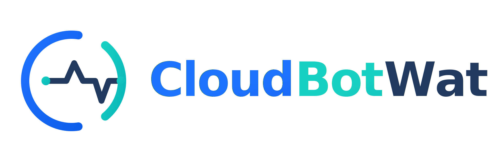

# CloudBotWatch Logger

A universal Cloudflare edge telemetry collector. Point it at any HTTP endpoint — works out of the box with [CloudBotWatch.com](https://cloudbotwatch.com), or bring your own backend.

[](https://deploy.workers.cloudflare.com/?url=https://github.com/CloudBotWatch/logger)

---

## What it does

The Worker intercepts every request passing through your Cloudflare zone, assembles a privacy-minimised telemetry record from Cloudflare edge metadata, and forwards it to your configured endpoint — all inside `ctx.waitUntil`, so your visitors are never affected.

Every outbound request is signed with HMAC-SHA256 (`X-Timestamp` + `X-Signature` headers) so your backend can verify the payload came from your Worker and not an external source.

---

## Quick start (Wrangler CLI)

```bash
git clone https://github.com/CloudBotWatch/logger.git
cd logger
npm install
cp .env.example .env
# Edit .env — set LOG_ENDPOINT and LOG_SECRET
npx wrangler dev
```

To deploy:

```bash
npx wrangler deploy
```

Set secrets in production (never commit them):

```bash
npx wrangler secret put LOG_SECRET
npx wrangler secret put LOG_ENDPOINT
```

---

## Routing your domain through the Worker

The Worker is a transparent proxy — it passes every request to your origin unchanged and logs the metadata asynchronously. Your site's behaviour and response times are not affected.

**Requirements:** your domain must be proxied through Cloudflare (orange cloud DNS record). The Worker cannot intercept traffic on DNS-only (grey cloud) records.

### Option A — Deploy to Cloudflare button (recommended)

Click the button at the top of this page. It forks the repo to your account, creates the Worker, and prompts you to add a route — all in one flow.

### Option B — Wrangler CLI

Add a `routes` block to `wrangler.toml` before deploying:

```toml
routes = [
  { pattern = "example.com/*", zone_name = "example.com" }
]
```

Replace `example.com` with your domain. Use `*example.com/*` to also cover subdomains. Then deploy:

```bash
npx wrangler deploy
```

### Option C — Cloudflare dashboard

1. Deploy the Worker first (`npx wrangler deploy`)
2. Go to **Workers & Pages → your worker → Settings → Triggers**
3. Under **Routes**, click **Add route**
4. Enter `example.com/*` and select your zone
5. Save

### Subdomain handling

Register your site using the zone apex (`example.com`) and use a wildcard route to cover all subdomains in one deployment:

```toml
routes = [
  { pattern = "*example.com/*", zone_name = "example.com" }
]
```

Every event includes the full `hostname` (`www.example.com`, `blog.example.com`, etc.), so you can filter by subdomain in the CloudBotWatch dashboard without needing separate Workers or separate site registrations.

### Verifying the route is active

After adding a route, every page request to your domain will trigger the Worker. Confirm in the Cloudflare dashboard under **Workers & Pages → your worker → Metrics** — you should see invocations appear within minutes of normal traffic.

If you are using CloudBotWatch, the dashboard shows a verify-connection indicator that confirms the first event has been received.

---

## Configuration

All settings are Cloudflare Worker environment variables. The `[vars]` block in `wrangler.toml` sets the defaults; override them in the Cloudflare dashboard under **Workers & Pages → your worker → Settings → Variables**.

| Variable | Default | Description |
|---|---|---|
| `LOG_ENDPOINT` | *(required)* | URL to POST telemetry to — CloudBotWatch ingest URL, ELK, Datadog, or any HTTP endpoint |
| `LOG_SECRET` | *(required)* | HMAC-SHA256 signing secret shared with your backend. Minimum 32 characters. |
| `LOG_HTML_ONLY` | `true` | When `true`, only log requests where the `Accept` header includes `text/html` — skips assets, XHR, and API calls. Best signal-to-noise ratio for bot detection. |
| `LOG_SAMPLE_RATE` | `1` | Fraction of requests to log (`0.0`–`1.0`). Set to `0.1` to log 10% of traffic. Useful for very high-traffic sites. |

---

## Collected fields

| Field | Value |
|---|---|
| `hostname` | Site hostname |
| `path` | Full URL path — query string excluded |
| `ray_suffix` | Last 4 characters of `CF-Ray` header only |
| `ip_range` | `/24` for residential ASNs; full IP for datacenter ASNs |
| `country` | Cloudflare country code |
| `asn` | Autonomous System Number |
| `asn_organization` | `request.cf.asOrganization` — human-readable ASN name |
| `cache_status` | `CF-Cache-Status` value |
| `referer` | Full Referer URL (truncated at 500 characters) |
| `user_agent` | Raw User-Agent string |
| `method` | HTTP method |
| `status` | HTTP response status code |

### Deliberately not collected

- Full IP address
- Full CF-Ray ID (last 4 characters only)
- Query strings
- Cookies or `Authorization` headers
- Request or response bodies
- Any sensitive headers

---

## IP masking

The Worker classifies the request's ASN organisation name against a built-in datacenter/backbone regex before sending:

- **Datacenter / hosting / backbone ASN** — full IP retained (infrastructure IPs are not personal data)
- **Residential / mobile ISP** — IP masked to `/24` before the payload leaves the Worker

This masking happens at the edge, before transmission. Your backend never receives an unmasked residential IP.

---

## Request signing

Every POST to `LOG_ENDPOINT` includes two headers:

```
X-Timestamp: <unix seconds>
X-Signature: <hex HMAC-SHA256>
```

The signature is computed over `timestamp=<X-Timestamp>&body=<raw JSON body>` using the `LOG_SECRET` key. Your backend should reject requests where the timestamp is more than 5 minutes old and where the signature does not match.

---

## Operational modes

| Mode | How to configure | Use case |
|---|---|---|
| HTML-only (default) | `LOG_HTML_ONLY=true` | Best bot detection signal — page loads only, no assets |
| Full logging | `LOG_HTML_ONLY=false` | Complete request picture for active incident investigation |
| Sampled | `LOG_SAMPLE_RATE=0.1` | 10% sample for very high-traffic sites managing ingestion cost |

---

## Using with CloudBotWatch

[CloudBotWatch.com](https://cloudbotwatch.com) is the hosted backend built for this Worker. It provides:

- Bot scoring per session group using Ray suffix, asset loading, timing, and ASN signals
- ASN intelligence with per-ASN risk profiles and classification
- WAF recommendation module — copy-paste Cloudflare WAF expressions ready to deploy
- Cross-site threat feed (ASNs observed as suspicious across multiple customer sites)
- Weekly email reports with traffic quality summary

After signing up, set `LOG_ENDPOINT` to your site's CloudBotWatch ingest URL and `LOG_SECRET` to the HMAC secret shown in the dashboard. No other changes needed.

---

## Privacy

CloudBotWatch Logger uses only metadata already available to Cloudflare at the edge. It does not use tracking cookies, JavaScript snippets, pixels, or advertising identifiers. All IP masking happens inside the Worker before any data leaves your zone.

See [cloudbotwatch.com/privacy](https://cloudbotwatch.com/privacy) for the full data processing and retention policy.
