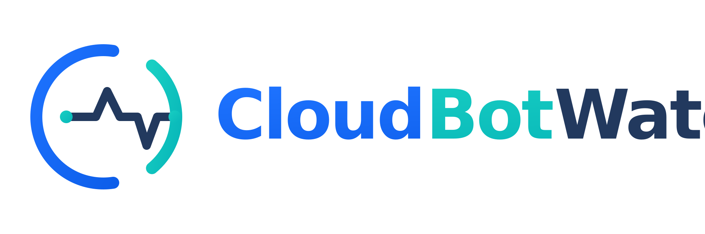

# CloudBotWatch Logger

A universal Cloudflare edge telemetry collector. Point it at any HTTP endpoint — works out of the box with [CloudBotWatch.com](https://cloudbotwatch.com), or bring your own backend.

## What it does

The Worker intercepts every request passing through your Cloudflare zone, assembles a privacy-minimised telemetry record from Cloudflare edge metadata, and forwards it to your configured endpoint — all inside `ctx.waitUntil`, so your visitors are never affected.

Every outbound request is signed with HMAC-SHA256 (`X-Timestamp` + `X-Signature` headers) so your backend can verify the payload came from your Worker and not an external source.

---

## Quick start

No local tooling required — deploy directly from the Cloudflare dashboard.


1. Copy the contents of [`logger.js`](https://raw.githubusercontent.com/CloudBotWatch/logger/main/logger.js)
2. Go to [dash.cloudflare.com](https://dash.cloudflare.com) → **Workers & Pages → Create**
3. Choose **Create Worker**, paste the code, and click **Deploy**
4. Go to **Settings → Variables** and add `LOG_ENDPOINT` and `LOG_SECRET` as encrypted secrets
5. Open your domain → **Workers Routes → Add route**. In one dialog: enter the **Route** `*example.com/*`, select this Worker, and — on the free plan — set **Failure mode** to *"Fail open (proceed)"*. Click **Save**. See [Cloudflare plan limits](#cloudflare-plan-limits--two-settings-to-check).

---

## Routing your domain through the Worker

The Worker is a transparent proxy — it passes every request to your origin unchanged and logs the metadata asynchronously. Your site's behaviour and response times are not affected.

**Requirements:** your domain must be proxied through Cloudflare (orange cloud DNS record). The Worker cannot intercept traffic on DNS-only (grey cloud) records.

### Subdomain handling

Register your site using your root domain (`example.com`) and use a single wildcard route to cover every subdomain:

```
*example.com/*
```

The leading `*` is what makes this work: `*example.com/*` matches the root domain **and** every subdomain — `example.com`, `www.example.com`, `blog.example.com`. Without it, `example.com/*` matches the root domain only and misses `www.` traffic entirely, which is a common cause of "the Worker is deployed but nothing logs".

Every event includes the full `hostname` (`www.example.com`, `blog.example.com`, etc.), so you can filter by subdomain in the CloudBotWatch dashboard without needing separate Workers or separate site registrations.

> **On the free Workers plan**, a broad wildcard route can burn through the daily request quota on static assets — see [Cloudflare plan limits](#cloudflare-plan-limits--two-settings-to-check) for how to narrow the route instead.

> **Avoid registering a subdomain as a separate CloudBotWatch site.** Because events are attributed to the most specific registered hostname, adding `blog.example.com` as its own site silently splits its events out of `example.com` — and can weaken bot detection for visitors who navigate between the two, since sessions are analysed per site. Use the dashboard's subdomain filter instead; register a subdomain separately only when it is a genuinely independent property.

### Verifying the route is active

After adding a route, every page request to your domain will trigger the Worker. Confirm in the Cloudflare dashboard under **Workers & Pages → your worker → Metrics** — you should see invocations appear within minutes of normal traffic.

If you are using CloudBotWatch, the dashboard shows a verify-connection indicator that confirms the first event has been received.

---

## Configuration

Both settings are Cloudflare Worker environment variables, set as encrypted **Secrets** under **Workers & Pages → your worker → Settings → Variables and Secrets**.

The Worker logs every request its route matches; there are no sampling or filtering options. Partial logging degrades session-level analysis, so to reduce volume narrow the **route pattern** instead — see [Cloudflare plan limits](#cloudflare-plan-limits--two-settings-to-check). (`LOG_HTML_ONLY` and `LOG_SAMPLE_RATE` existed in earlier versions and are no longer read.)

| Variable | Default | Description |
|---|---|---|
| `LOG_ENDPOINT` | *(required)* | URL to POST telemetry to — CloudBotWatch ingest URL, ELK, Datadog, or any HTTP endpoint |
| `LOG_SECRET` | *(required)* | HMAC-SHA256 signing secret shared with your backend. Minimum 32 characters. |

---

## Collected fields

| Field | Value |
|---|---|
| `hostname` | Site hostname |
| `path` | Full URL path — query string excluded |
| `ray_suffix` | Last 4 characters of `CF-Ray` header only |
| `ip_range` | `/24` (IPv4) or `/64` (IPv6) for residential ASNs; full IP for datacenter ASNs |
| `country` | Cloudflare country code |
| `asn` | Autonomous System Number |
| `asn_organization` | `request.cf.asOrganization` — human-readable ASN name |
| `cache_status` | `CF-Cache-Status` value |
| `referer` | Full Referer URL (truncated at 500 characters) |
| `user_agent` | Raw User-Agent string |
| `method` | HTTP method |
| `status` | HTTP response status code |

### Deliberately not collected

- Full IP address
- Full CF-Ray ID (last 4 characters only)
- Query strings
- Cookies or `Authorization` headers
- Request or response bodies
- Any sensitive headers

---

## IP masking

The Worker classifies the request's ASN organisation name against a built-in datacenter/backbone regex before sending:

- **Datacenter / hosting / backbone ASN** — full IP retained (infrastructure IPs are not personal data)
- **Residential / mobile ISP** — IP masked to `/24` (IPv4) or `/64` (IPv6) before the payload leaves the Worker

This masking happens at the edge, before transmission. Your backend never receives an unmasked residential IP.

---

## Request signing

Every POST to `LOG_ENDPOINT` includes two headers:

```
X-Timestamp: <unix seconds>
X-Signature: <hex HMAC-SHA256>
```

The signature is computed over `timestamp=<X-Timestamp>&body=<raw JSON body>` using the `LOG_SECRET` key. Your backend should reject requests where the timestamp is more than 5 minutes old and where the signature does not match.

---

## Cloudflare plan limits — two settings to check

**Set the route to fail open.** Failure mode is a property of the **route**, not the Worker — it lives in Cloudflare's **Add route / Edit route** dialog, as a pair of radio cards below the route pattern. It defaults to *"Fail closed (block)"*, which returns an error page to visitors once the Worker exceeds its limits. Select **"Fail open (proceed)"** so overflow requests bypass the Worker to your origin instead. This is the single most important setting for running this Worker safely.

> **Free plan only.** The Failure mode section appears only on the Workers Free plan — the 100k/day cap it guards against doesn't apply on paid. If you don't see it in the route dialog, you're on a paid plan and there's nothing to set.

**Mind the free Workers quota.** Cloudflare's free plan allows **100,000 Worker requests per day across all Workers on your account**, and this logger runs on every request routed through it — asset-heavy pages can consume the quota quickly. Cloudflare's Workers Paid plan raises the limit far beyond that; enable it before relying on the logger for any site with real traffic.

**The route pattern is the only lever on quota.** Once a request matches the route the invocation is spent, whether the Worker logs it or not — so the only way to reduce quota consumption is to narrow the **route pattern** so fewer requests reach the Worker at all:

- Route specific paths instead of everything — e.g. `*example.com/blog/*` rather than `*example.com/*`. Route patterns cannot exclude paths, so match only what you want logged; scrapers go after content, so content-only routing usually costs little, but you won't see bot traffic on the paths you leave out.
- Serve static assets from a subdomain (e.g. `static.example.com`) that the route doesn't cover.

On an asset-heavy page a `/*` route can spend 90% of its invocations on images, stylesheets, and fonts. Narrowing the route keeps those requests off your quota entirely, and you keep full detail on the paths you do monitor.

---

## Using with CloudBotWatch

[CloudBotWatch.com](https://cloudbotwatch.com) is the hosted backend built for this Worker. It provides:

- Bot scoring per session group using Ray suffix, asset loading, timing, and ASN signals
- ASN intelligence with per-ASN risk profiles and classification
- WAF recommendation module — copy-paste Cloudflare WAF expressions ready to deploy
- Cross-site threat feed (ASNs observed as suspicious across multiple customer sites)
- Weekly email reports with traffic quality summary

After signing up, set `LOG_ENDPOINT` to your site's CloudBotWatch ingest URL and `LOG_SECRET` to the HMAC secret shown in the dashboard. No other changes needed.

---

## Privacy

CloudBotWatch Logger uses only metadata already available to Cloudflare at the edge. It does not use tracking cookies, JavaScript snippets, pixels, or advertising identifiers. All IP masking happens inside the Worker before any data leaves your zone.

See [cloudbotwatch.com/privacy](https://cloudbotwatch.com/privacy) for the full data processing and retention policy.

---

## License

MIT — see [LICENSE](LICENSE). Copyright (c) 2026 CloudBotWatch.

You are free to use, modify, and redistribute this Worker, including commercially and with a backend of your own. Keep the copyright notice with the code.
